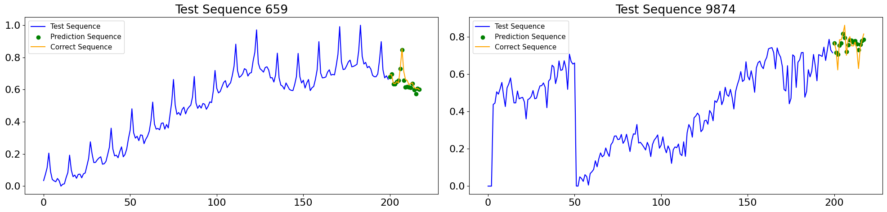

# Artificial Neural Networks and Deep Learning HW2 - AY 2023/2024

## Challenge: Timeseries Forecasting

	

The objective of this challenge was to train a regressor capable of accurately predicting future timesteps across various time series

### Architectural Exploration:

During our quest to tackle the challenges posed by this project, we embarked on an extensive exploration of various neural network architectures. We meticulously examined the strengths and weaknesses of each architecture, aiming to find the most suitable model for our task. Our exploration journey led us through a diverse landscape of architectures, including:

- **MultiLayer Perceptrons (MLPs)**: We began by experimenting with traditional MLPs, exploring their capability to capture complex patterns in the data. This approach was inspired by the insights from this [paper](https://arxiv.org/abs/2304.04553).

- **1D Convolutions**: Recognizing the effectiveness of convolutional layers in capturing local patterns, we investigated the application of 1D convolutions in our models.

- **Recurrent Neural Networks (RNNs)**: Delving deeper, we explored the realm of RNNs, experimenting with different variants such as Gated Recurrent Units (GRUs) and Long Short-Term Memory networks (LSTMs). These architectures were particularly intriguing due to their ability to retain memory over time steps, which is crucial for sequential data analysis.

- **Hybrid Models**: Combining the strengths of both LSTM and 1D convolutional layers, we crafted hybrid architectures to leverage the benefits of both approaches.

- **Seq2Seq Models**: Inspired by the success of sequence-to-sequence learning in various domains, we ventured into building Seq2Seq models, both with and without attention mechanisms. These models aimed to capture the temporal dependencies within the data and facilitate accurate predictions.

- **Transformer Architectures**: In pursuit of cutting-edge solutions, we explored transformer architectures, known for their effectiveness in handling sequential data with parallel processing.

### Challenges Encountered:

Despite our enthusiasm and efforts, we encountered significant challenges during our architectural exploration. The training processes for Seq2Seq and Transformer models proved to be exceptionally demanding in terms of computational resources and time. As a result, we faced difficulties in fine-tuning these models to achieve optimal performance.

### Optimal Solution:

After thorough experimentation and evaluation, we discovered that a synergistic fusion of Convolutional and LSTM mechanisms yielded the most promising results. This hybrid approach effectively captured both local patterns and long-term dependencies in the data, leading to robust predictions in our task.

## More Information

For a detailed overview of the challenge, methods, and models built, please refer to the [report](Report_Challenge_2.pdf) and the [notebooks](/Notebooks).

### Results

Our team attained a MSE of 0.01008289 on the private test set, placing us in the top 25% among 560+ participants.

## Team
* [Jacopo Piazzalunga](https://github.com/Jacopopiazza)
* [Davide Salonico](https://github.com/DavideSalonico)
* [Gabriele Puglisi](https://github.com/GabP404)
* [Denis Sanduleanu](https://github.com/DenSandu)

